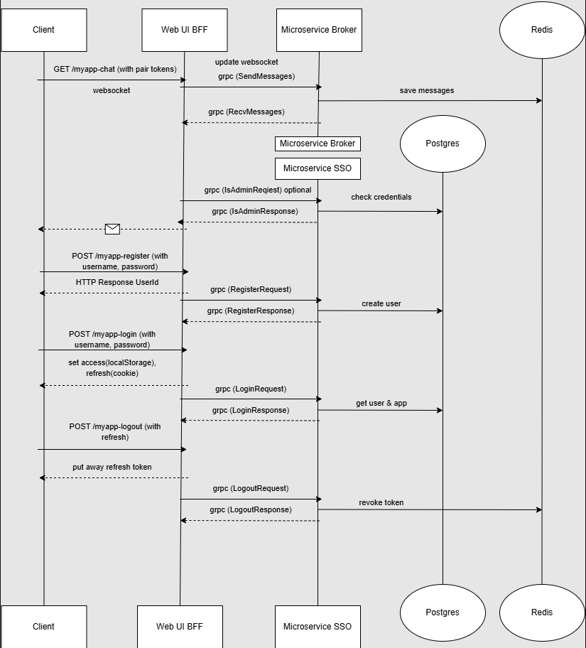

[Backend Application]

## Build & Run (Locally)
### Prerequisites
- go 1.24
- docker & docker-compose

To work with JWT tokens, you need to create a private RSA key and store it in ./secrets/private.pem.

Create sso.env file in root directory and add following values ​​to it to run in local machine:
```dotenv

DSN=host=0.0.0.0 user=user password=password dbname=postgres port=5555 sslmode=disable
REDIS_ADDR=0.0.0.0:6379
REDIS_PASS=redis_password
REDIS_CACHE=0
APP_SECRET=your-very-long-and-secure-secret-key-here-256-bit
PG_USER=user
PG_PASSWORD=password
PG_DB=postgres
PG_LOCAL_PORT=5555
```

Run in docker:
```dotenv

DSN=host=postgres user=user password=password dbname=postgres port=5432 sslmode=disable
REDIS_ADDR=redis:6379
REDIS_PASS=redis_password
REDIS_CACHE=0
APP_SECRET=your-very-long-and-secure-secret-key-here-256-bit
PG_USER=user
PG_PASSWORD=password
PG_DB=postgres
PG_LOCAL_PORT=5555
```

Use command 'task in-docker-auth' to build&run sso service in docker, or 'task run-auth'.


Create chat.env file in root directory and add following values ​​to it to run in local machine:
```dotenv

DSN=host=localhost user=user password=password dbname=postgres port=5600 sslmode=disable
APP_SECRET=your-very-long-and-secure-secret-key-here-256-bit
PG_USER=user
PG_PASSWORD=password
PG_DB=postgres
PG_LOCAL_PORT=5600
```

To run in docker:
```dotenv

DSN=host=postgres user=user password=password dbname=postgres port=5600 sslmode=disable
APP_SECRET=your-very-long-and-secure-secret-key-here-256-bit
PG_USER=user
PG_PASSWORD=password
PG_DB=postgres
PG_LOCAL_PORT=5600
```

Use command 'task in-docker-chat' to build&run chat service in docker, or 'task run-chat'.




# Архитектура проекта

Проект реализован по микросервисной архитектуре с применением **BFF** (*Backend for Frontend*) уровня для взаимодействия с фронтендом.

## Коммуникационные протоколы

|                   | Протокол              |
|------------------|----------------------|
| Клиент ↔ BFF слой | REST API              |
| BFF слой ↔ Сервисы | gRPC                  |
| Чат-функционал   | WebSocket             |

### REST endpoints

#### Аутентификация пользователей

| Эндпоинт           | Метод | Описание                     | Пример тела запроса                              |
|--------------------|-------|-----------------------------|-------------------------------------------------|
| `/myapp-register`  | POST  | Регистрация нового аккаунта  | `{"username": "example", "password": "passw0rd"}` |
| `/myapp-login`     | POST  | Вход в систему               | `{"username": "example", "password": "passw0rd", "appid": "app_id_123"}` |
| `/myapp-logout`    | POST  | Завершение сессии            | `{"refresh_token": "refr_token_here"}`          |

### Чат-функционалы

| Эндпоинт    | Метод | Описание                         |
|-------------|-------|----------------------------------|
| `/myapp-chat` | GET   | Установление WebSocket-соединения |

## Токены

- **Access Token**: Хранится в локальной переменной клиента.
- **Refresh Token**: Сохраняется в cookie-файлах браузера.

## Внутреннее взаимодействие сервисов

Сервисы взаимодействуют друг с другом через **gRPC**, используя предварительно подготовленные `.proto` файлы. Репозиторий с описаниями контрактов доступен здесь: https://github.com/Krokozabra213/protos

### Логика обработки запросов
1. Пользователь отправляет REST-запросы на сервер (BFF уровень).
2. BFF-посредник направляет запросы в соответствующий микросервис посредством протокола gRPC.

### Чат-сессия
Пользователи подключаются к эндпоинту /myapp-chat, устанавливающему постоянное WebSocket-соединение для отправки сообщений и уведомлений.
