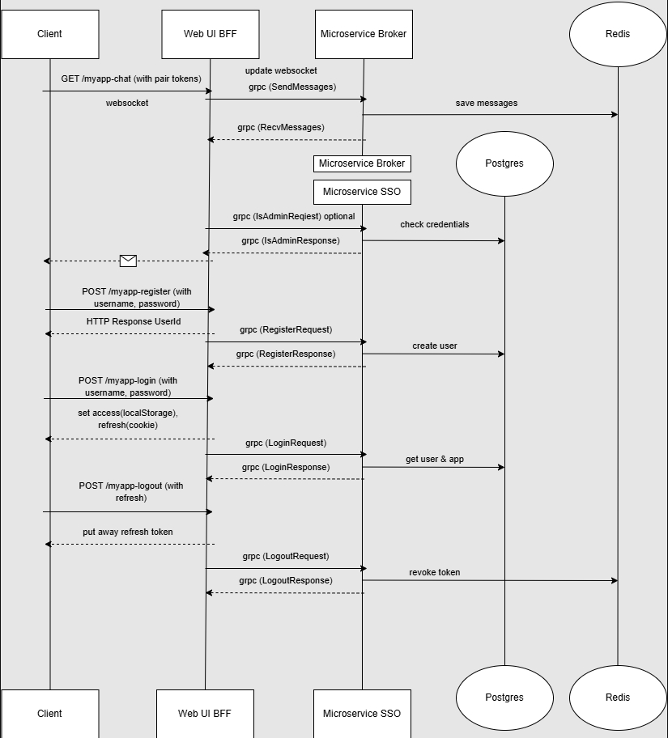

# Архитектура проекта

Проект реализован по микросервисной архитектуре с применением **BFF** (*Backend for Frontend*) уровня для взаимодействия с фронтендом.

## Коммуникационные протоколы

|                   | Протокол              |
|------------------|----------------------|
| Клиент ↔ BFF слой | REST API              |
| BFF слой ↔ Сервисы | gRPC                  |
| Чат-функционал   | WebSocket             |

### REST endpoints

#### Аутентификация пользователей

| Эндпоинт           | Метод | Описание                     | Пример тела запроса                              |
|--------------------|-------|-----------------------------|-------------------------------------------------|
| `/myapp-register`  | POST  | Регистрация нового аккаунта  | `{"username": "example", "password": "passw0rd"}` |
| `/myapp-login`     | POST  | Вход в систему               | `{"username": "example", "password": "passw0rd", "appid": "app_id_123"}` |
| `/myapp-logout`    | POST  | Завершение сессии            | `{"refresh_token": "refr_token_here"}`          |

### Чат-функционалы

| Эндпоинт    | Метод | Описание                         |
|-------------|-------|----------------------------------|
| `/myapp-chat` | GET   | Установление WebSocket-соединения |

## Токены

- **Access Token**: Хранится в локальной переменной клиента.
- **Refresh Token**: Сохраняется в cookie-файлах браузера.

## Внутреннее взаимодействие сервисов

Сервисы взаимодействуют друг с другом через **gRPC**, используя предварительно подготовленные `.proto` файлы. Репозиторий с описаниями контрактов доступен здесь: https://github.com/Krokozabra213/protos

### Логика обработки запросов
1. Пользователь отправляет REST-запросы на сервер (BFF уровень).
2. BFF-посредник направляет запросы в соответствующий микросервис посредством протокола gRPC.

### Чат-сессия
Пользователи подключаются к эндпоинту /myapp-chat, устанавливающему постоянное WebSocket-соединение для отправки сообщений и уведомлений.

Для работы с JWT-токенами необходимо создать приватный ключ формата **RSA**. Это делается следующим образом:

### Шаг 1. Проверка наличия OpenSSL

Проверьте наличие установленной утилиты `openSSL`. Используйте команду:

openssl version

Если команда возвращает версию программы, значит всё установлено правильно. Если же появляется сообщение типа "command not found", установите её вручную:

- Скачать последнюю версию OpenSSL можно отсюда:

https://slproweb.com/products/Win32OpenSSL.html или воспользуйтесь менеджером пакетов Chocolatey: bashchoco install openssl

### Шаг 2. Генерация ключа 
Переходим в корень вашего проекта и открываем каталог secrets. Далее вводим команду для генерации закрытого ключа длиной 2048 бит: bashopenssl genpkey -algorithm RSA -out private.pem -pkeyopt rsa_keygen_bits:2048Это создаст файл private.pem, содержащий ваш приватный ключ. Этот ключ должен храниться в секретном месте и использоваться исключительно для подписи JWT-токенов.
---
Теперь у вас есть готовый закрытый ключ для работы с JWT-аутентификацией.